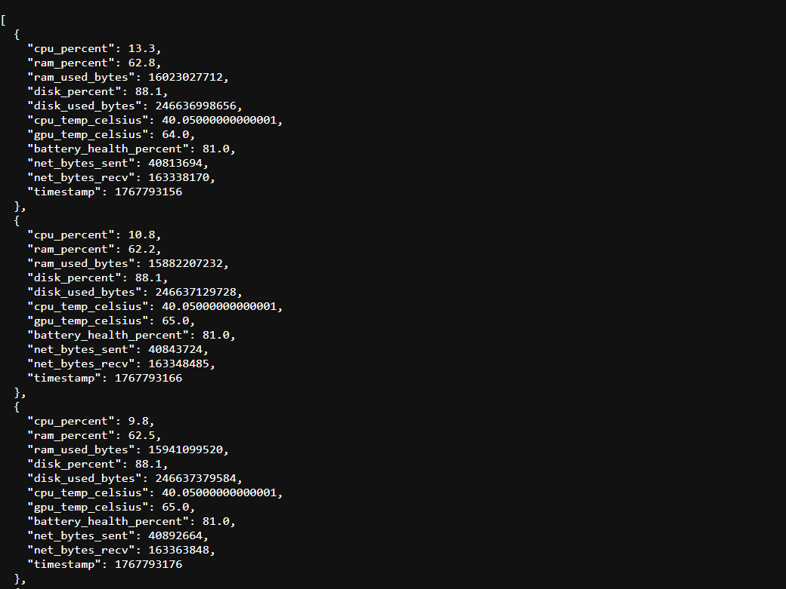
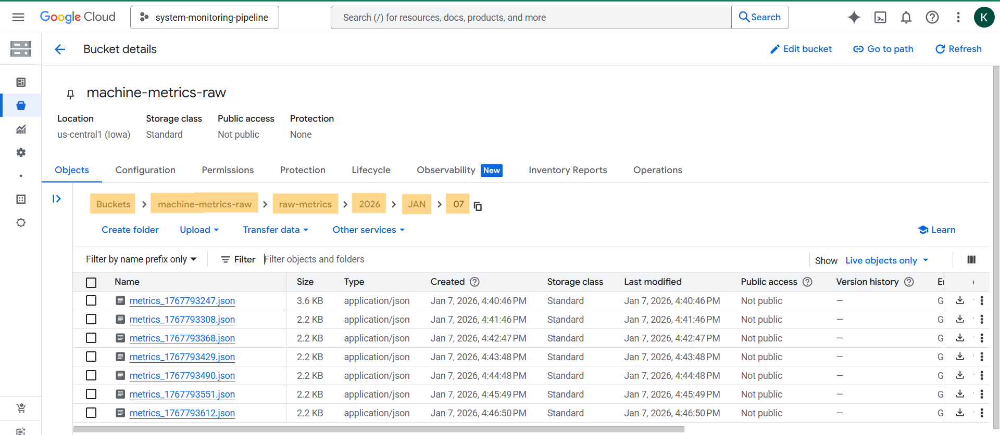
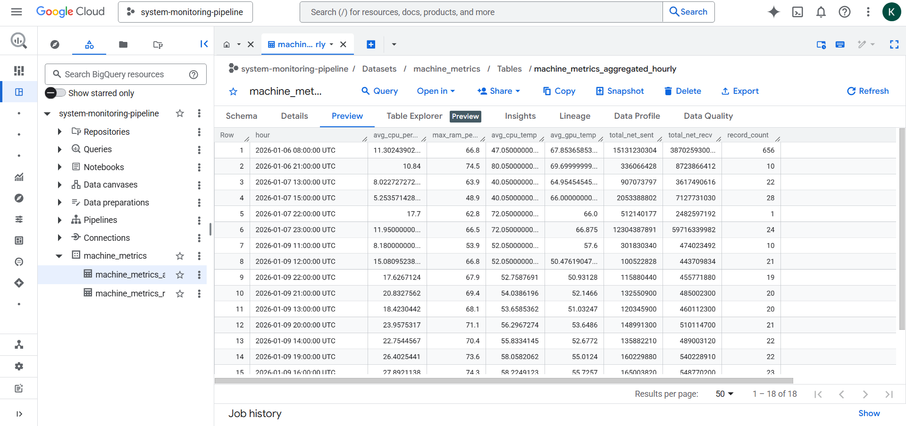

# System-Metrics-Streaming-Pipeline

## Overview

This project implements an end-to-end **`Streaming`** + **`Batch`** data pipeline for collecting and analyzing system-level metrics using **`Apache Kafka`**, **`Apache Airflow`**, **`Docker`**, and **`Google Cloud Platform`**.

A **`Kafka producer`** continuously gathers machine metrics (**CPU, RAM, disk, GPU, temperature, battery health, and network I/O**) and streams them to a Kafka topic.  

A **`Kafka consumer`** reads the events, batches them, and writes **time-partitioned** JSON files to **Google Cloud Storage (GCS)**, forming a raw data lake.

An **`Apache Airflow DAG`**, running hourly, orchestrates batch workflows that load raw metrics from GCS into **`BigQuery`**, compute **hourly aggregations**, and store analytics-ready tables for monitoring and analysis.

The pipeline demonstrates core **Streaming** and **Batch Processing** concepts, including **producer/consumer architecture**, **time-based partitioning**, **containerized orchestration**, and **cloud data warehousing**.

---

## Tech Stack

- **Languages:** Python, SQL
- **Streaming Platform:** Apache Kafka
- **Workflow Orchestration:** Apache Airflow
- **Cloud Services:** Google Cloud Storage (GCS), BigQuery
- **Infrastructure:** Docker
- **Libraries:** Kafka Python Client, Pandas, Google Cloud SDK, BigQuery Client , psutil, GPUtil, wmi 

---

## Project Architecture

This project follows a modern streaming-first data architecture:

Components:

- Kafka Producer (Python)
  - Collects system metrics every 10 seconds
  - Publishes metrics to a Kafka topic ``machine_metrics``

- Apache Kafka
    - Central streaming backbone
    - Durable, ordered event log

- Kafka Consumer (Python)
  - Reads messages from Kafka
  - Buffers records into batches
  - Flushes data to **GCS** based on size or time

- Google Cloud Storage (Data Lake)
  - Stores raw metrics as JSON files
  - **Partitioned** by ingestion date

- Apache Airflow
  - Runs in **Docker**
  - Orchestrates hourly batch workflows
  - Loads raw metrics from **GCS** into **BigQuery**
  - Computes and stores hourly aggregated metrics in **BigQuery**

---

## Project Flow

1️⃣ **Metrics Collection & Streaming**

System metrics are collected from the local machine: (CPU usage, RAM usage, Disk usage, GPU temperature, CPU temperature, Battery health, Network I/O)
Metrics are serialized as JSON and published to Kafka.

Below is an example of a single record produced by the Kafka producer and stored in GCS:

2️⃣ **Kafka Consumption & Batching**
The consumer subscribes to the Kafka topic.
Messages are accumulated in memory.
Data is flushed when 50 records are collected OR 60 seconds have passed.

3️⃣ **Raw Data Storage (GCS)**

Batched metrics are uploaded to GCS as JSON files.
Files are partitioned by ingestion time:

This layout enables easy replay, backfills, and future batch processing.

4️⃣ **Airflow Orchestration (Hourly)**

Airflow is intended to run hourly DAGs to:
  - Load raw data from GCS into a BigQuery raw table
  - Compute aggregated metrics (averages, trends, summaries)
  - Store aggregated results into a BigQuery analytics table

Below is a screenshot of what data in the aggregated table in BigQuery looks like:

This allows analysts to query both:
- Raw metrics for debugging, replay, or detailed inspection
- Aggregated metrics for reporting, monitoring, and dashboards

---
 
## Skills Demonstrated

- **Apache Kafka**
  - Producer / Consumer model
  - Topic-based event streaming
  - Decoupled ingestion architecture

- Streaming Data Engineering
  - Continuous event generation
  - Near real-time ingestion
  - Immutable raw event storage

- Cloud Data Lake Design

  - Raw data stored in GCS
  - Time-based partitioning (year / month / day)
  - JSON event storage for replayability

- Dockerized Development
  - Kafka running locally in containers
  - Airflow running in Docker using Astro
  - Production-like local environment

- Apache Airflow
  - Containerized hourly DAG for batch processing
  - Loads raw JSON metrics from GCS to BigQuery
  - Performs idempotent hourly aggregations into analytics tables
  - Manages task dependencies and scheduling in a production-style workflow

---

## Use Case
This pipeline is suitable for systems that require:
  - Continuous monitoring of machine or server metrics
  - Long-term retention of raw telemetry data for auditing or troubleshooting
  - Aggregated analytics for performance monitoring and reporting

--- 

## Example

A company wants to monitor its computers or servers in real time.
  - The Kafka producer streams CPU, memory, disk, GPU, battery, and network metrics to Kafka.
  - The consumer batches and stores raw metrics in Google Cloud Storage.
  - Airflow runs hourly to load raw metrics into BigQuery and compute aggregates (averages, trends, alerts) for performance monitoring dashboards.

This allows system administrators to track health trends, detect anomalies early, and analyze historical performance efficiently.

